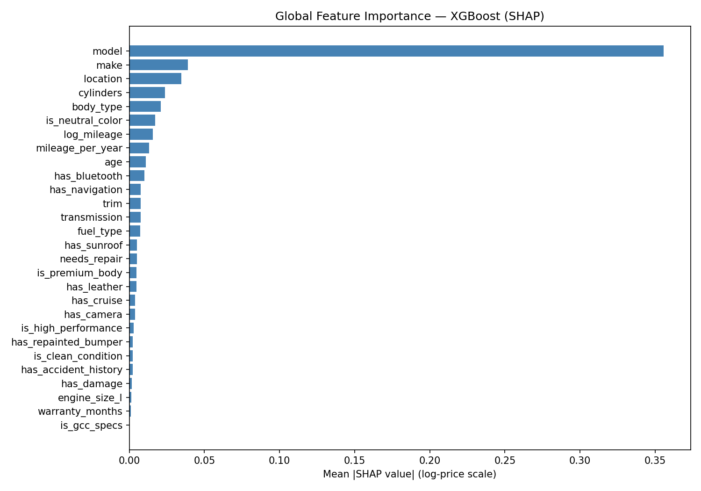
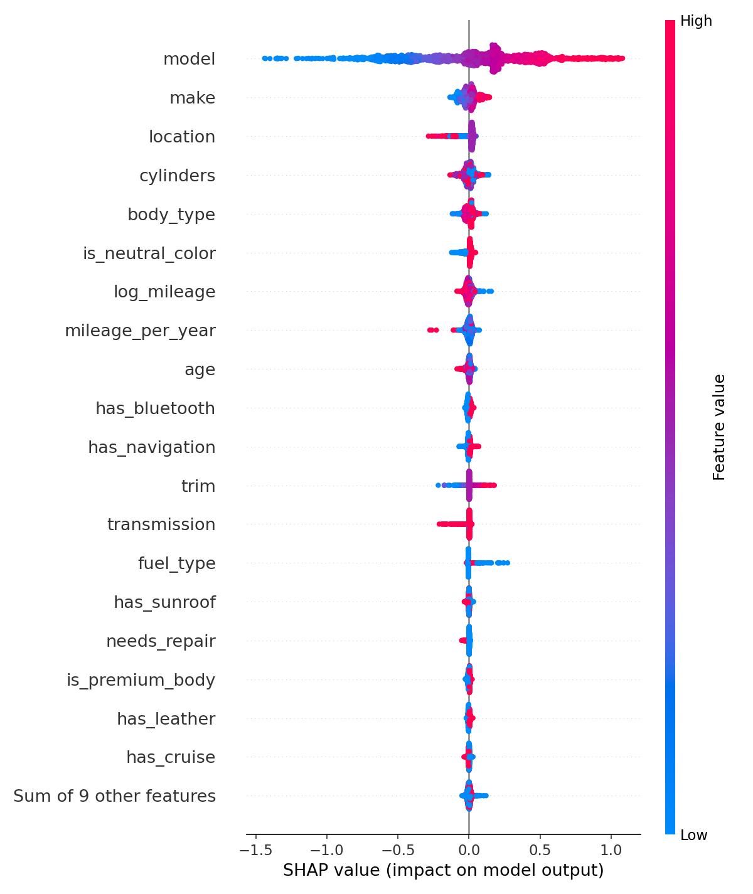

# UAE Used Car Price Predictor

Predicts used car prices (AED) from a 10,000-row UAE listings dataset. Built end-to-end: scraping, cleaning, feature engineering, model training, SHAP explainability, and a prediction script.

**Best model: XGBoost — MAE AED 36,985 | R² 0.50**  
Phase 1 baseline (Random Forest): MAE AED 85,758 → 57% reduction over 5 phases.

---

## Results

| Model             | MAE (AED) | CV MAE  | R²    |
|-------------------|-----------|---------|-------|
| XGBoost           | 36,985    | 35,268  | 0.500 |
| Random Forest     | 37,466    | 35,510  | 0.483 |
| Gradient Boosting | 37,987    | 35,944  | 0.482 |
| Linear Regression | 38,707    | 36,561  | 0.466 |

MAE is evaluated on a held-out 20% test split. CV MAE is 5-fold cross-validation across the full dataset.

---

## SHAP Feature Importance

`model` (target-encoded) dominates at 9x the importance of any other feature. Description/condition features (sunroof, camera, etc.) have minimal impact — consistent with the dataset being synthetic.




---

## Pipeline

Run scripts in order:

```bash
python scraper.py          # scrape Cars24 listings
python clean.py            # clean raw dataset → uae_used_cars_clean.csv
python merge.py            # merge scraped + kaggle data → uae_cars_merged.csv
python feature_eng.py      # engineer features → uae_used_cars_features.csv
python encoder.py          # encode + split → X_train.npy, encodings.json
python train.py            # train all models, save xgboost_model.json
python shap_explain.py     # generate SHAP plots → outputs/
```

To predict a single car's price, edit the `CAR` dict in `predict.py` and run it:

```bash
python predict.py
```

```
----------------------------------------
  2020 Toyota Camry
  60,000 km | 4 cyl | automatic
----------------------------------------
  Predicted price:  AED 47,613
----------------------------------------
```

---

## Features (28 total)

| Group | Features |
|---|---|
| Identity | `make`, `model`, `trim` (target-encoded) |
| Numerical | `age`, `log_mileage`, `mileage_per_year`, `cylinders`, `engine_size_l` |
| Categorical | `transmission`, `fuel_type`, `body_type`, `location` (label-encoded) |
| Description | `has_sunroof`, `has_leather`, `has_camera`, `has_cruise`, `has_navigation`, `has_bluetooth` |
| Condition | `is_clean_condition`, `has_accident_history`, `needs_repair`, `has_repainted_bumper`, `has_damage` |
| Engineered | `is_neutral_color`, `is_high_performance`, `is_premium_body` |

---

## Setup

```bash
python -m venv .venv
.venv/Scripts/activate        # Windows
source .venv/bin/activate     # Mac/Linux

pip install pandas numpy scikit-learn xgboost shap matplotlib
```

---

## Dataset

- **Kaggle**: [UAE Used Cars Dataset](https://www.kaggle.com/](https://www.kaggle.com/code/ayberkural/car-price-prediction-in-the-uae-marke/input) — 10,000 listings
- **Cars24**: scraped via `scraper.py` (Selenium)
- Price capped at AED 300,000 to remove exotic car outliers
- After cleaning: 9,742 rows
